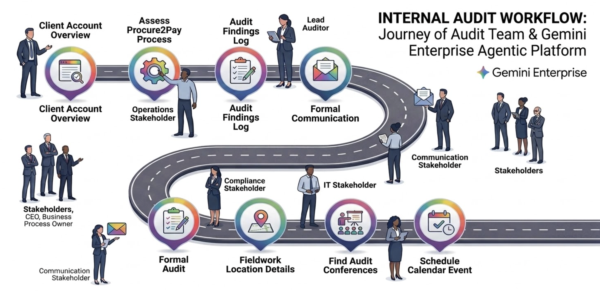

## Scenario 1: An internal auditor at Neuravibe has been assigned to conduct a preliminary risk assessment for a new, high-value client account, "Future Gamers." To understand the potential financial, operational, and compliance risks associated with this business relationship, the auditor first needs to gather high-level business context. 

## ผู้ตรวจสอบภายในของ Neuravibe ได้รับมอบหมายให้ทำการประเมินความเสี่ยงเบื้องต้นสำหรับบัญชีลูกค้าใหม่ที่มีมูลค่าสูงชื่อ "Future Gamers" เพื่อทำความเข้าใจความเสี่ยงทางการเงิน การดำเนินงาน และการปฏิบัติตามกฎระเบียบที่อาจเกิดขึ้นจากความสัมพันธ์ทางธุรกิจนี้ ผู้ตรวจสอบจำเป็นต้องรวบรวมข้อมูลบริบททางธุรกิจในระดับสูงก่อน

### Prompt 1: Client Account Overview

```
Tell me about Future Gamers account, Recent Activities, Financials, Meetings
```


## Scenario 2 : An internal auditor at Neuravibe is kicking off the annual audit of the company's third-party vendor management program. "Future Gamers" has been identified as a critical vendor due to the high volume of transactions and deep integration with Neuravibe's operations. The auditor's first step is to assess the Procure-to-Pay (P2P) process related to the Future Gamers account.


## สถานการณ์ที่ 2: ผู้ตรวจสอบภายในของ Neuravibe กำลังเริ่มต้นการตรวจสอบประจำปีของโปรแกรมการจัดการผู้ขายภายนอกของบริษัท "Future Gamers" ถูกระบุว่าเป็นผู้ขายที่สำคัญเนื่องจากปริมาณธุรกรรมสูงและการบูรณาการอย่างลึกซึ้งกับการดำเนินงานของ Neuravibe ขั้นตอนแรกของผู้ตรวจสอบบัญชีคือการประเมินกระบวนการจัดซื้อจัดจ้างและการชำระเงิน (Procure-to-Pay หรือ P2P) ที่เกี่ยวข้องกับบัญชี Future Gamers


### Prompt 2: Assess Procure2Pay process for Future Gamers Account

```
Tell me about the Procure-to-Pay process, Recent Control Testing Results, Identified Risks, and related Management Action Plans for Future Gamers.
```


## Scenario 3 : The internal auditor has identified several control deficiencies from their initial review of the Procure-to-Pay process. To effectively track these issues and the subsequent corrective actions, they need to create a structured log. A spreadsheet is the ideal format for this. They will use Gemini Enterprise to generate the initial draft of this audit findings register, which can then be exported.


## สถานการณ์ที่ 3:
ผู้ตรวจสอบภายในได้พบข้อบกพร่องด้านการควบคุมหลายประการจากการตรวจสอบเบื้องต้นของกระบวนการจัดซื้อจัดจ้างและการชำระเงิน เพื่อให้สามารถติดตามปัญหาเหล่านี้และมาตรการแก้ไขที่ตามมาได้อย่างมีประสิทธิภาพ พวกเขาจำเป็นต้องสร้างบันทึกที่มีโครงสร้าง และสเปรดชีตเป็นรูปแบบที่เหมาะสมที่สุด พวกเขาจะใช้ Gemini Enterprise ในการสร้างร่างแรกของทะเบียนผลการตรวจสอบนี้ ซึ่งสามารถส่งออกได้ในภายหลัง

### Prompt 3: Audit Findings Log

```
Generate a detailed audit findings log for the Procure-to-Pay process in a table format suitable for export to a spreadsheet. Include columns for 'Finding ID', 'Observation', 'Associated Risk', 'Recommendation', and 'Risk Rating'.
```


## Scenario 4: The auditor is preparing a slide deck to present their findings to management. To clearly illustrate where the control breakdowns are occurring, they need a process map that visually pinpoints the weaknesses identified in the findings log.

## ## สถานการณ์ที่ 4: ผู้ตรวจสอบกำลังเตรียมสไลด์เพื่อนำเสนอผลการตรวจสอบต่อฝ่ายบริหาร เพื่อให้เห็นภาพชัดเจนว่าจุดบกพร่องในการควบคุมเกิดขึ้นที่ใด พวกเขาจึงต้องการแผนผังกระบวนการที่ชี้ให้เห็นจุดอ่อนที่ระบุไว้ในบันทึกผลการตรวจสอบอย่างชัดเจน


### Prompt 4: Visual Asset

```
Generate a process flow diagram of the Procure-to-Pay cycle as an image. Use callouts to highlight the control points where high-risk findings were identified.

```

## Scenario 5: With the initial findings documented, the next step is to formally communicate them to the business owner responsible for the process. The auditor needs to draft a clear, professional email to the Head of Procurement to ensure there is a formal record and to schedule a follow-up meeting.

## สถานการณ์ที่ 5: เมื่อบันทึกผลการตรวจสอบเบื้องต้นแล้ว ขั้นตอนต่อไปคือการสื่อสารผลการตรวจสอบอย่างเป็นทางการไปยังเจ้าของธุรกิจที่รับผิดชอบกระบวนการนั้น ผู้ตรวจสอบบัญชีจำเป็นต้องร่างอีเมลที่ชัดเจนและเป็นมืออาชีพถึงหัวหน้าฝ่ายจัดซื้อ เพื่อให้แน่ใจว่ามีการบันทึกอย่างเป็นทางการและเพื่อกำหนดวันประชุมติดตามผล

### Prompt 5: Formal Audit Communication

```
Write an email to the Head of Procurement anilsr@google.com summarizing the critical audit findings from the Procure-to-Pay review. Request a meeting to discuss the observations and develop management action plans.
```

### Prompt 5.1: Send the email

```
Send the email
```


## Scenario 6: The audit plan requires a physical inspection of the warehouse to review inventory controls. The auditor needs to find the exact location of the primary distribution center operated by Future Gamers to plan their on-site visit.

## สถานการณ์ที่ 6: แผนการตรวจสอบต้องการการตรวจสอบคลังสินค้าเพื่อทบทวนการควบคุมสินค้าคงคลัง ผู้ตรวจสอบจำเป็นต้องค้นหาที่ตั้งของศูนย์กระจายสินค้าหลักที่ดำเนินการโดย Future Gamers เพื่อวางแผนการเยี่ยมชมสถานที่

### Prompt 6: Fieldwork Location Details

```
@Addresses : What is the address of Future Gamer's main distribution center?
```

## Scenario 7: The auditor has confirmed the on-site fieldwork will take place at the Chiang Mai office. To prepare for their business travel, they need to check the local conditions to pack appropriately.

## สถานการณ์ที่ 7: ผู้ตรวจสอบได้ยืนยันแล้วว่าการตรวจสอบภาคสนามจะเกิดขึ้นที่สำนักงานในแอตแลนตา เพื่อเตรียมตัวสำหรับการเดินทางไปทำธุรกิจ พวกเขาจำเป็นต้องตรวจสอบสภาพอากาศในท้องถิ่นเพื่อจัดกระเป๋าให้เหมาะสม

### Prompt 7: Contextual Planning for On-Site Audit

```
I have to conduct audit fieldwork at their ChiangMai office. How is the weather there in ChiangMai?
```


## Scenario 8: To stay current on industry best practices and new auditing techniques, the auditor is looking for professional development opportunities. They use Gemini Enterprise to search for relevant conferences and training events.

## สถานการณ์ที่ 8: เพื่อให้ทันต่อแนวทางปฏิบัติที่ดีที่สุดในอุตสาหกรรมและเทคนิคการตรวจสอบใหม่ๆ ผู้ตรวจสอบกำลังมองหาโอกาสในการพัฒนาวิชาชีพ พวกเขาใช้ Gemini Enterprise เพื่อค้นหาการประชุมและการฝึกอบรมที่เกี่ยวข้อง

### Prompt 8: Professional Development Inquiry

```
Are there any major Internal Audit or GRC (Governance, Risk, and Compliance) conferences coming up in 2026?
```

## Scenario 9: After finding a relevant event, the "14th Annual Meeting of the GRC" the auditor decides to attend. They use Gemini Enterprise to quickly block the time on their work calendar.

## สถานการณ์ที่ 9: หลังจากพบกิจกรรมที่เกี่ยวข้องคือ "14th Annual Meeting of the GRC " ผู้ตรวจสอบตัดสินใจเข้าร่วม พวกเขาใช้ Gemini Enterprise เพื่อจองเวลาในปฏิทินการทำงานของพวกเขาอย่างรวดเร็ว

### Prompt 9: Schedule Professional Development

```
Add the "14th Annual Meeting of the GRC" to my calendar.
```

## Scenario 10: The internal audit team is conducting a vendor risk assessment on a critical third-party service provider, "CloudServe Inc.," which processes sensitive company data. The auditor needs to perform a deep-dive analysis to determine if the vendor's controls and financial stability meet Neuravibe's standards, or if they introduce unacceptable risk to the organization.

## สถานการณ์ที่ 10: ทีมตรวจสอบภายในกำลังดำเนินการประเมินความเสี่ยงของซัพพลายเออร์ที่เป็นบุคคลที่สามที่สำคัญ "CloudServe Inc." ซึ่งประมวลผลข้อมูลที่ละเอียดอ่อนของบริษัท ผู้ตรวจสอบจำเป็นต้องทำการวิเคราะห์ในเชิงลึกเพื่อพิจารณาว่าการควบคุมและความมั่นคงทางการเงินของซัพพลายเออร์เป็นไปตามมาตรฐานของ Neuravibe หรือไม่ หรือว่าพวกเขาก่อให้เกิดความเสี่ยงที่ยอมรับไม่ได้ต่อองค์กร

## Research Agent

### Prompt 10

```
Create a report analyzing our third-party vendor "Google Inc." using their latest SOC 2 report and annual financial statements. Analyze their control environment, any noted exceptions or deficiencies, data privacy policies, and financial health. Conclude with an opinion on whether their risk profile is acceptable according to our vendor management policy.

```

## Search Company Colleagues

### Activity 1 : AutoComplete Access Details

```
@Sergio V
```

### Prompt 11

```
get me details about  @sergio V
```


## Scenario : An auditor faces the daily manual task of checking for new audit policy updates before starting their work. They create a Gemini Enterprise agent scheduled to run automatically every morning, well before the workday begins. This agent proactively identifies any policy changes and analyzes yesterday's transactions for non-compliance against the new rules. A complete summary report is now waiting in the auditor's email drafts, turning a reactive chore into proactive insight.


## Scenario ผู้ตรวจสอบต้องเผชิญกับงานที่ต้องทำด้วยตนเองทุกวันในการตรวจสอบการอัปเดตนโยบายการตรวจสอบใหม่ๆ ก่อนเริ่มงาน พวกเขาสร้าง Agent ของ Gemini Enterprise ให้ทำงานอัตโนมัติทุกเช้า ก่อนเวลาทำงานปกติ Agent นี้จะค้นหาการเปลี่ยนแปลงนโยบายและวิเคราะห์ธุรกรรมของเมื่อวานเพื่อหาการไม่ปฏิบัติตามกฎใหม่ ตอนนี้ รายงานสรุปฉบับสมบูรณ์ก็พร้อมรออยู่ในฉบับร่างอีเมลของผู้ตรวจสอบ เปลี่ยนงานที่ต้องรอทำซ้ำๆ ให้กลายเป็นข้อมูลเชิงลึกเชิงรุก

## Create an Agent

### Activity : Click on Create Agent  
### Activity : Click on Proceed to Builder
### Activity : Click on Agent
### Activity : Name Agent

```
Neuravibe Audit Policy Daily Changes Checker
```

### Activity : Add Description

```
Agent to help interact with enterprise data.
```

### Activity : Add Instructions

```
-- Scan @AuditPolcies folder in Google Drive

-- Identify today's policies

-- Summarize Policy

-- Highlight most important points

-- Use emojis to make the summary pleasant to read

-- Handover to immediate attention sub agent
```

### Activity : Create Sub Agent

```
Immediate Attention
```

```
Immediate Action - If summary contains keyword immediate action create a calendar event
```

```
-- Show Summary

-- Check Summary , If summary talks about immediate attention - Create calendar event in my calendar today at 10 AM
```

### Prompt

```
Brenda lee, personal, for help with analyzing audit statement. I couldn't have done without you.
```
## Scenario: The Internal Audit department is launching its annual Security & Compliance Awareness month. To make the training material more engaging, they want to create a short, animated video to share on the company's internal social network, warning employees about the dangers of phishing emails.

## สถานการณ์: ฝ่ายตรวจสอบภายในกำลังเปิดตัวเดือนแห่งการตระหนักรู้ด้านความปลอดภัยและการปฏิบัติตามกฎระเบียบประจำปี เพื่อทำให้สื่อการฝึกอบรมน่าสนใจยิ่งขึ้น พวกเขาต้องการสร้างวิดีโอแอนิเมชั่นสั้นๆ เพื่อแชร์บนโซเชียลเน็ตเวิร์กภายในของบริษัท เพื่อเตือนพนักงานเกี่ยวกับอันตรายของอีเมลฟิชชิ่ง

## Create a Video

```
The Internal Audit team wants to create a training video for new hires on identifying phishing risks. Generate an animated video with a stick figure cautiously inspecting an email and joyfully says, "You got to learn to spot the phish!". The audit team wants to use this for an internal awareness campaign.

```


